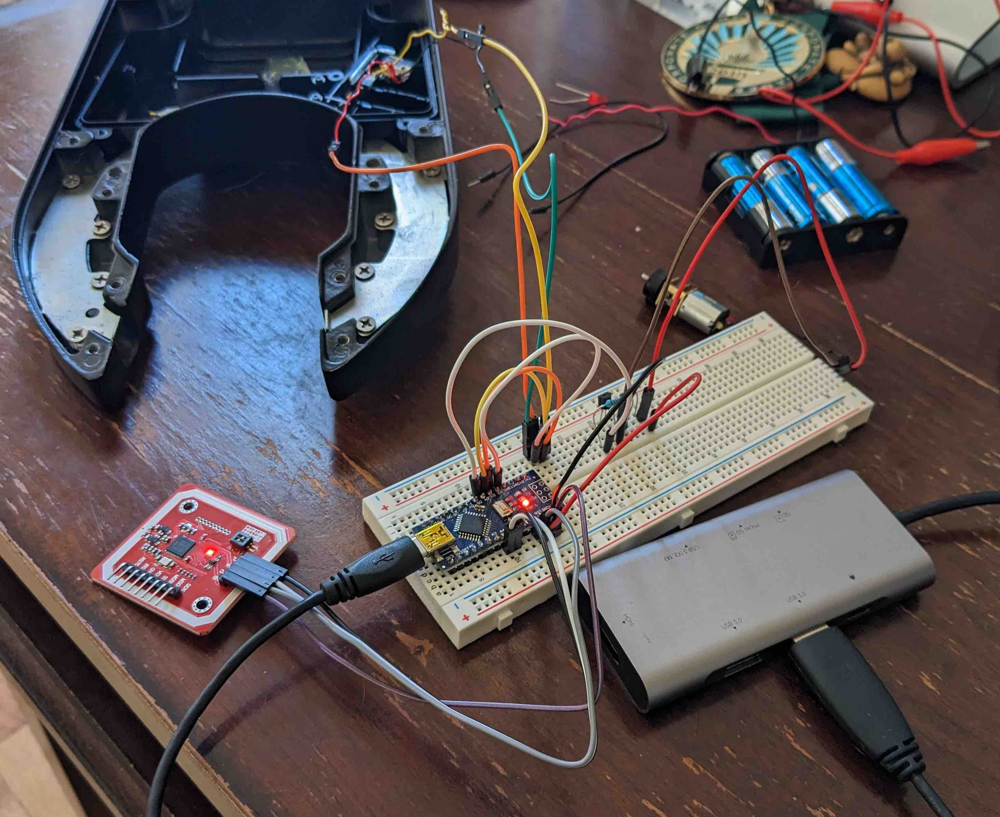

# Lime Project

A story of a repurposed rideshare e-bike.

## Intro

I found the bike on Facebook Marketplace for $100. It was a Lime bike that had been supposedly surrendered to some city in the LA area. I bought it as a project to learn more about e-bikes and to also get a cheap e-bike out of the experience.

The story seemed somewhat legit. The previous owner seemed to have around 200 Lime e-bikes. So either the story was true or he was the best Lime bike thief in the world. I'm going to assume the former.

## The Bike

The bike seemed almost new. It still had some of the plastic film for packing around the crank arms and other pieces.

The bike is from 2017 and they called it the "LIME-E BETA". It has a Bafang motor (maybe 250W?), Bafang torque/cadence bottom bracket, 14.5Ah 36V battery, Shimano nexus brakes, all aluminum construction (besides a a few small steel brackets) and solid tires. It's a heavy, no maintenance bike.

The main issue was that the bike was totally dead. The battery was near 0V. Even with an external power supply feeding 36V to the controller, the bike did nothing.

## Battery Revival

I ended up going against the recommendations of most of my electrically inclined friends and decided to jump start the battery. I was doing this on a budget and I thought I could get away with it by trickle charging the cells. The cells also didn't look like they were damaged or swollen in any way so it seemed mostly safe. I wouldn't recommend this but it did work for me.

For that, I opened up the battery, isolated each parallel group and used a few spare 18650 cells to boost them up until my RC charger would accept them on the li-ion setting. Once the whole battery was around 30V, I used a normal 36v li-ion charger to charge it up the rest of the way.

It was a bit of a pain finding the right connector for the battery. I wasn't expecting some weird connector usually used for audio devices (XLR4) but, in the end, I was able to make it work with some globs of solder and crimps.

## The Brains

Even with a fully charged battery, the bike didn't do anything. I had no idea how to turn it on. I believe the bike is supposed to turn on when the phone app sends a command to unlock and turn on the bike. My desire to have a working bike was beginning to outweigh wanting to reverse engineer how the Lime cellular chip worked with the motor controller. So in the interest of time, I bought a cheapo "KT" motor controller of eBay for about $60 all-in (4-1 connector, display and controller). If I get another chance to work on another one of these bikes, I'd probably try to figure out how that interface works so that I can keep the original motor controller.

This new controller greatly simplified things but also lost some features of the original. The original controller supported a torque and cadence sensor. The new controller only supported cadence. The original controller had outputs for lights. The new controller didn't. One pro was that the bike no longer needed an app to turn on. I could just turn it on with the display.

## First Ride

TBD

## NFC Lock

The last step of the project was to make the original lock work with some other kind of system. It's such a cool integrated lock. No need to carry around a big lock just to secure the bike for a few minutes during the day. For this, I chose NFC. NFC seemed like a good choice because the cards and fobs are waterproof (perfect for surfing) and they are cheap. It also would work with my phone when biking around town.

The parts list was pretty short:

- [PN532 NFC/RFID module](https://www.amazon.com/HiLetgo-Communication-Arduino-Raspberry-Android/dp/B01I1J17LC)
- [Elegoo Nano](https://www.elegoo.com/products/elegoo-nano-v3-0)

I was able to re-use most of the components of the lock (limit switches and motor for the rotating pin) but I got rid of the speaker and LEDs for simplicity.

I powered the whole set up with a 9V battery. This might bite me in the future but it was the easiest way to get it working. The Nano and PN532 are both 5V devices so I waste some power going through the Nano's voltage regulator. I also used a transistor to drive the motor directly from the battery to protect the Nano from drawing too much current. I don't have any way to tell if the 9V battery is low and it'll suck if I get locked out of my bike because the battery died. I might make a backup system in the future. And/or switch it to a rechargeable battery.

The code for the lock is in [lock.ino](lock.ino) and the NFC enclosure that I made is in [NFC Enclosure.stl](NFC Enclosure.stl). The NFC enclosure replaces the locks original cellular antenna enclosure. I cut off the original enclosure with a dremel and glued the new one on with hot glue.

## Outro

Thanks for reading! I hope this was helpful for anyone else trying to revive a Lime bike. I'm sure more of these rideshare bikes will be available in the future as the companies go out of business, their guerilla deployments fail or they upgrade their fleets. I'm excited to see what people do with them.

I'm happy to answer any questions about the project. Feel free to email me.
